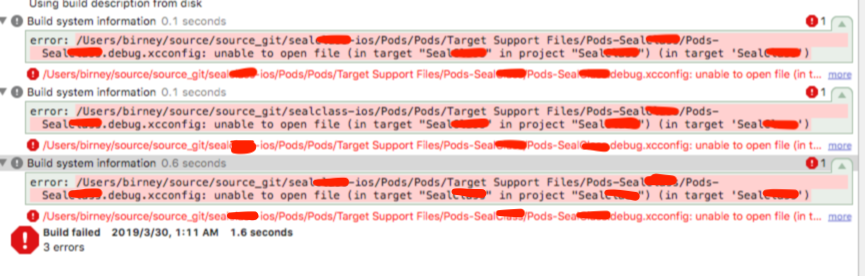
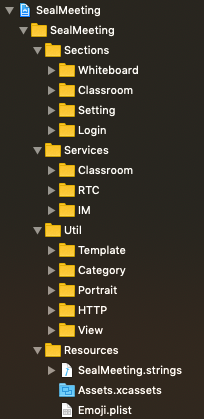
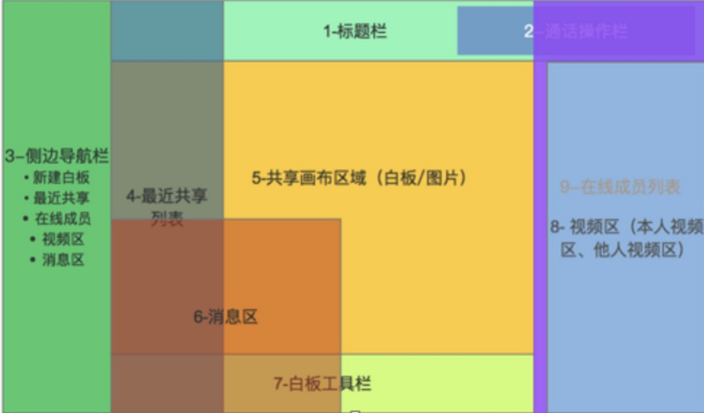

# SealMeeting-iOS

本文档介绍了 SealMeeting 的整体框架设计和核心流程，为开发者了解 SealMeeting 的主要功能提供指导性说明。[体验 SealMeeting](https://www.rongcloud.cn/downloads/demo)。

**前期准备**

1. [注册融云开发者](https://www.rongcloud.cn)，创建应用后获取 APPKey。

2. 开通音视频服务。[查看音视频计费明细](https://www.rongcloud.cn/docs/call.html#billing)

3. 必须自行部署 [SealMeeting-Server](https://github.com/rongcloud/sealmeeting-server)

	保证自行部署的服务和 iOS 端 AppKey 一致

4. 服务部署完毕之后，请分别修改源码 `APPKey`,`BuglyKey`,`WeChatKey`,`BASE_URL` 为您自己的

	参见源码中 `AppDelegate.m`,`HTTPUtility.m`，其中 `APPKey 和 BASE_URL 为必填项`，`WeChatKey` 用来做微信分享

5. `注意`



如果出现这样的编译失败问题请进入终端，在 SealMeeting.xcodeproj 的同级目录下执行下面命令

`git checkout -- SealMeeting.xcodeproj/project.pbxproj`

问题的原因是不同版本的 pod 对 xcode 配置文件的处理是不一致的，会导致某些文件找不到，执行上面命令清空本地对 SealMeeting.xcodeproj/project.pbxproj 修改，避免冲突

## 代码目录介绍
iOS 端整体目录结构主要由 Sections，Services，Util，Resources 四个部分组成。



* Section 由四部分组成，每个部分都包含了整个功能的全部实现。WhiteBoard 白板功能，Setting 设置功能， Classroom 会议功能，Login 登录功能。

* Services 由三部分组成，IM 管理类，Classroom 管理类， RTC 管理类。

* Util 通用的一些工具类。

* Resources 包含了国际化文件，图片资源，以及 Emoji 表情。

## 主体业务介绍
SealMeeting 的主体业务主要在 Sections 文件夹里。分为白板（WhiteBoard），设置（Setting），会议（Classroom）, 登录（Login）。每个模块按照具体的功能再次进一步划分。

### 登录
---
登录模块的 UI 在 `LoginViewController.m` 文件里。相关的业务逻辑实现在 `LoginHelper.m` 文件里。 SealMeeting 依赖于 IMService，RTCService，ClassroomService。首先要调用 ClassroomService 登录会议，成功之后调用 IMService 连接 IM 。IM 连接成功之后调用 RTCService 加入房间。  

* 登录成功的回调

```
- (void)classroomDidJoin:(Classroom *)classroom;

```

* 登录失败的回调

```
- (void)classroomDidJoinFail;

```
### 设置
---
设置模块分为两个页面，一个是展示用户选择的分辨率页面 `SettingViewController.m` ，另一个是选择分辨率的页面 `SelectResolutionController.m` 。
### 会议
---
会议区域主要分为标题栏（Title），通话操作栏（Title），侧边导航栏（ToolPanel），最近共享列表（RecentShared），共享画布区域（MainContainer），消息区（Chat），视频区（VideoList），在线成员列表（PersonList）八个部分。



**标题栏，通话操作栏**     
对应于 Title 文件夹下的 `ClassroomTitleView`文件 。包含了以下内容：加入会议的时间计时，会议ID，摄像头切换，麦克风开关，摄像头开关，静音开关，以及退出会议功能。相关事件回调在 `ClassroomViewController.m` 文件的`- (void)classroomTitleView:(UIButton *)button didTapAtTag:(ClassroomTitleViewActionTag)tag` 代理里。

**侧边导航栏**     
对应于 ToolPanel 文件夹下的 `ToolPanelView` 文件。包含了新建白板，最参会人近共享，人员列表，视频列表，消息区展示。
相关事件回调在 `ClassroomViewController.m` 文件的 `- (void)toolPanelView:(UIButton *)button didTapAtTag:(ToolPanelViewActionTag)tag;` 代理里。


**最近共享列表**   
对应于 RecentSharedView 文件夹下的 `RecentSharedView` 文件。展示的是主持人和主讲人的视频和白版。只有主持人和主讲人可以看到和操作最近共享列表。

**共享画布区域**  
对应于 MainContainer 文件夹下的 `MainContainerView`文件。展示了共享的视频或白板

**消息区**   
对应于 Chat 文件夹下的 `ChatAreaView`文件。可以在消息区发送和接受会议中的消息。

**视频区**
对应于 VideoListView 文件夹下的 `VideoListView`文件。展示了会议中除了列席以外的人的视频。

**在线成员列表**   
对应于 PersonList 文件夹下的 `PersonListView`文件。主持人可以对列席里边的成成员进行角色以及设备等的控制。

### 白板
---
白板模块 `WhiteboardControl`文件里。主持人或者会议点击了共享白板或者新建白板，共享画布区会显示此白板。

## Service 部分介绍
Service 部分由 （音视频）RTCService，（IM）IMService，（会议）ClassroomService 三个部分组成。
### RTCService 说明
---
对应于`RTCService` 文件。通过单例模式实现。

* 加入房间

```
/**
 加入 rtc 房间

 @param roomId 房间 id
 @param success 成功
 @param error 失败
 */
- (void)joinRongRTCRoom:(NSString *)roomId success:(void (^)( RongRTCRoom *room))success error:(void (^)(RongRTCCode code))error;
-
```

* 退出房间

```
/**
 退出 rtc 房间

 @param roomId 房间 id
 @param success 成功
 @param error 失败
 */
- (void)leaveRongRTCRoom:(NSString*)roomId success:(void (^)(void))success error:(void (^)(RongRTCCode code))error;

```

* 发布当前用户的音视频流

```
/**
 发布当前用户的音视频流
 */
- (void)publishLocalUserDefaultAVStream;

```

* 取消发布当前用户的音视频流

```
/**
 取消发布当前用户的音视频流
 */
- (void)unpublishLocalUserDefaultAVStream;

```

* 将当前用户的视频渲染到指定 view 上

```
/**
 将当前用户的视频渲染到指定 view 上

 @param view view
 @param enable 是否开启摄像头
 */
- (void)renderLocalVideoOnView:(UIView *)view cameraEnable:(BOOL)enable;

```

* 将除当前用户外其他用户的视频渲染到指定 view 上

```
/**
 将除当前用户外其他用户的视频渲染到指定 view 上

 @param view view
 @param userId 其他用户 id
 */
- (void)renderRemoteVideoOnView:(UIView *)view forUser:(NSString *)userId;

```

*  将某个用户的屏幕共享渲染到指定 view 上

```
/**
 将某个用户的屏幕共享渲染到指定 view 上

 @param view view
 @param userId 用户 id
 */
- (void)renderUserSharedScreenOnView:(UIView *)view forUser:(NSString *)userId;

```

*  取消 view 上的视频渲染

```
/**
 取消 view 上的视频渲染

 @param view 需要被取消渲染的 view
 @return 取消渲染是否成功
 */
- (BOOL)cancelRenderVideoInView:(UIView *)view;

```

*  订阅远端用户的音视频流

```
/**
 订阅远端用户的音视频流

 @param remoteUser 远端用户
 */
- (void)subscribeRemoteUserAVStream:(RongRTCRemoteUser *)remoteUser;

```

* 取消订阅远端用户的音视频流

```
/**
 取消订阅远端用户的音视频流

 @param remoteUser 远端用户
 */
- (void)unsubscribeRemoteUserAVStream:(RongRTCRemoteUser *)remoteUser;

```

*   关闭/打开麦克风

```
/**
 关闭/打开麦克风

 @param disable YES 关闭，NO 打开
 */
- (void)setMicrophoneDisable:(BOOL)disable;

```


*   采集运行中关闭或打开摄像头

```
/**
 采集运行中关闭或打开摄像头

 @param disable YES 关闭，否则打开
 */
- (void)setCameraDisable:(BOOL)disable;

```

* 切换前后摄像头

```
**
 切换前后摄像头
 */
- (void)switchCamera;
```

* 切换使用外放/听筒

```
/**
 切换使用外放/听筒
 */
- (void)useSpeaker:(BOOL)useSpeaker;

```

*  关闭音视频流

```
/**
 关闭音视频流

 */
- (void)stopCapture;

```

*  获取当前用户的视频截图

```
/**
 获取当前用户的视频截图

 @return 截图
 */
- (UIImage *)imageForCurrentUser;

```

*  获取除当前用户之外其他人的视频截图

```
/**
 获取除当前用户之外其他人的视频截图

 @param userId 用户 id
 @return 截图
 */
- (UIImage *)imageForOtherUser:(NSString *)userId;

```

*  更新当前用户视频截图

```
/**
 更新当前用户视频截图

 */
- (void)refreshCurrentImage;

```

### IMService 说明
---
对应于 `IMService` 文件。通过单例模式实现。主要用于会议内收发消息，以及接收服务端下发的信令消息。

### ClassroomService 说明
---
对应于 `ClassroomService ` 文件。通过单例模式实现。所有接口调用均通过代理形式返回结果，需要设置代理监听。

*  通过实现如下代理来监听会议人员变化

```
- (void)roomDidLeave;
- (void)memberDidJoin:(RoomMember *)member;
- (void)memberDidLeave:(RoomMember *)member;
- (void)memberDidKick:(RoomMember *)member;

```

*  除降级以外的其他角色变化

```
- (void)roleDidChange:(Role)role forUser:(RoomMember *)member;
```

*  转让主持人，主讲人收到的回调如下。其他人员收到的是 `- (void)roleDidChange:(Role)role forUser:(RoomMember *)member` 回调。

```
- (void)adminDidTransfer:(RoomMember *)oldAdmin newAdmin:(RoomMember *)newAdmin;

```

*  用户设备（麦克风，摄像头）的打开和关闭的回调

```
- (void)deviceDidEnable:(BOOL)enable  type:(DeviceType)type forUser:(RoomMember *)member operator:(NSString *)operatorId;

```

*  主持人请求用户打开设备的回调，主持人关闭用户设备没有回调。

```
- (void)deviceDidInviteEnable:(DeviceType)type ticket:(NSString *)ticket;

```

*  用户同意或者拒绝主持人打开设备，主持人收到的回调

```
- (void)deviceInviteEnableDidApprove:(RoomMember *)member type:(DeviceType)type;

- (void)deviceInviteEnableDidReject:(RoomMember *)member type:(DeviceType)type;

```

*  列席申请成为参会人，主持人收到的回调

```
- (void)upgradeDidApply:(RoomMember *)member ticket:(NSString *)ticket overMaxCount:(BOOL)isOver;

```

*  列席申请成为参会人，主持人接受或者拒绝申请之后，列席收到的回调

```
- (void)applyDidApprove;

- (void)applyDidReject;

- (void)applyDidFailed:(ErrorCode)code;

```

*  列席申请成为参会人/主持人邀请列席成为列席，超时没有回应的回调

```
- (void)ticketDidExpire:(NSString *)ticket;

```

*  创建白板成功之后的回调，只有创建者能收到。

```
- (void)whiteboardDidCreate:(Whiteboard *)board;
- (void)whiteboardDidDelete:(Whiteboard *)boardId;

```

*  显示白板的回调，所有人都能收到

```
- (void)whiteboardDidDisplay:(NSString *)boardId;

```

*  显示主讲人的回调，所有人都能收到

```
- (void)speakerDidDisplay;

```

*  显示主持人的回调，所有人都能收到

```
- (void)adminDidDisplay;

```

*  显示共享屏幕的回调，所有人都能收到

```
- (void)sharedScreenDidDisplay:(NSString *)userId;

```

*  显示空白的回调，所有人都能收到

```
- (void)noneDidDisplay;

```

*  所有操作错误的回调。

```
- (void)errorDidOccur:(ErrorCode)code;

```
